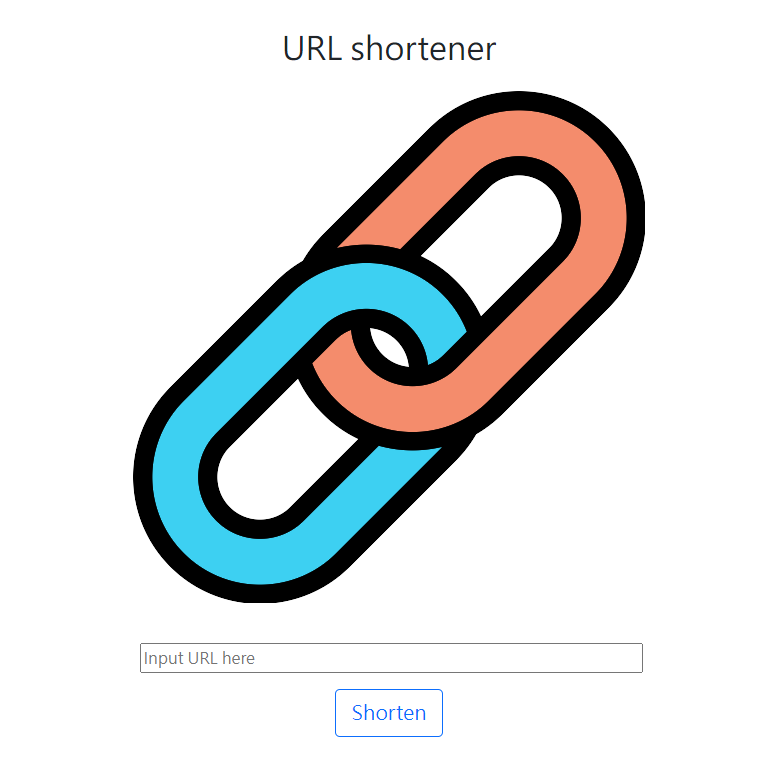

# URL Shortener 短網址產生器

## 介紹



提供短URL以代替原來可能較長的URL，將長的URL位址縮短。 使用者存取縮短後的URL時，通常將會重新導向到原來的URL。

## 功能

- 輸入網址轉換成短網址
- 點擊按鈕複製網址
- 透過短網址轉址到原本網址

## 開始使用

1. 請先確認有安裝 node.js 與 npm
2. 將專案 clone 到本地
```
https://github.com/happygod119/URLshortener.git
```
3. 安裝 npm 套件

```
npm install
```

4. 執行程式

```
npm run start
```

5.若出現此行網址代表運行順利

```
Express is listening on http://localhost:3000
```

## 開發工具

- Node.js 14.16.0
- Express 4.17.1
- Express-Handlebars 4.0.2
- MongoDB
- mongoose 6.1.8
- shortid 2.2.16
-valid-url 1.0.9
